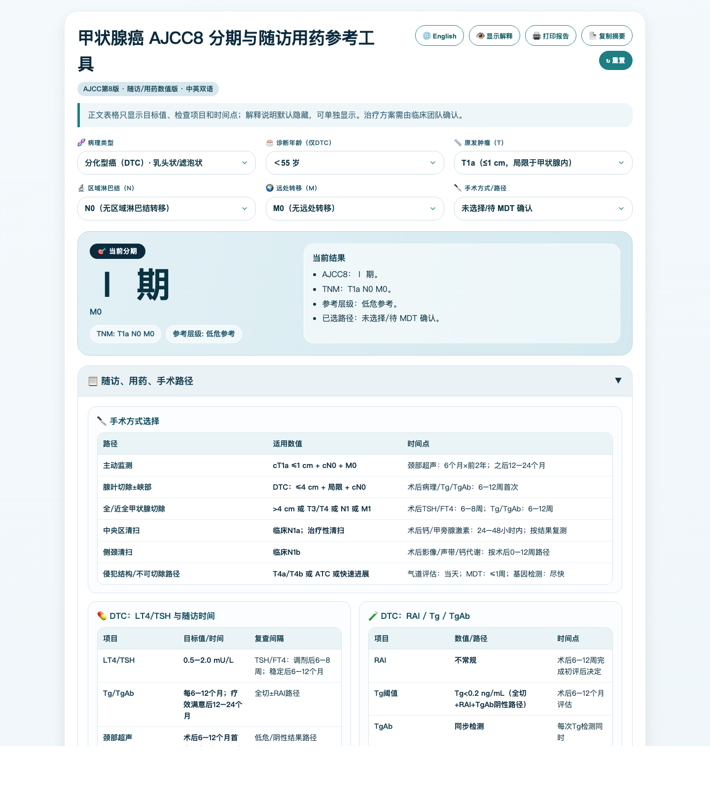
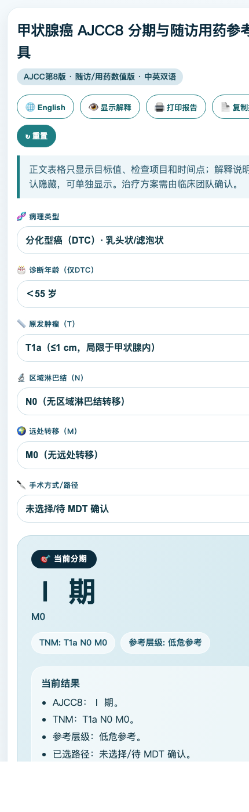

<div align="center">
  <h1>Thyroid TNM Tool</h1>
  <p><strong>更像产品页展示的甲状腺癌 TNM 分期网页工具，含 PC 原版与独立手机版。</strong></p>
  <p><strong>简体中文</strong> | <a href="README.md">English</a></p>

  <p>
    <a href="https://github.com/liqi3333/thyroid/releases/latest"></a>
    <a href="https://github.com/liqi3333/thyroid/releases"></a>
    <a href="https://github.com/liqi3333/thyroid/actions/workflows/build-html.yml"></a>
    <a href="https://github.com/liqi3333/thyroid/actions/workflows/release.yml"></a>
  </p>

  <p>
    <a href="https://liqi3333.github.io/thyroid/"></a>
    <a href="https://liqi3333.github.io/thyroid/mobile.html"></a>
    <a href="https://github.com/liqi3333/thyroid/releases/latest"></a>
  </p>
</div>

## 项目简介

Thyroid TNM Tool 现在不只是一个单文件 HTML，而是已经整理成一个可公开访问、可自动发布、可在线使用的产品化网页项目。

当前提供两个明确分开的入口：

- **PC 网页版**：保留原始桌面布局与阅读体验
- **手机版网页**：单独的 `mobile.html`，专门为手机浏览器优化

## 网页版截图

<p align="center">
  <a href="https://liqi3333.github.io/thyroid/">
    
  </a>
</p>
<p align="center"><em>PC 网页版</em></p>

<p align="center">
  <a href="https://liqi3333.github.io/thyroid/mobile.html">
    
  </a>
</p>
<p align="center"><em>手机版网页</em></p>

## 这个项目现在有什么价值

- 可快速查看甲状腺癌 AJCC 第 8 版 TNM 分期
- 在同一页面查看治疗计划与随访建议
- 无需后端，无需安装，网页可直接打开
- 既可在线使用，也可下载独立 HTML 离线打开
- 不强行做成同一套响应式，而是把 PC 和手机体验拆开做

## 访问入口

- GitHub 仓库：<https://github.com/liqi3333/thyroid>
- PC 在线页面：<https://liqi3333.github.io/thyroid/>
- 手机在线页面：<https://liqi3333.github.io/thyroid/mobile.html>
- 最新 Release：<https://github.com/liqi3333/thyroid/releases/latest>
- 全部 Releases：<https://github.com/liqi3333/thyroid/releases>

## 当前交付形态

仓库目前提供以下交付方式：

- `index.html`，PC 原版网页
- `mobile.html`，与最新双语随访版本保持同步的手机入口
- Release 附件：`Thyroid-TNM-Tool-2.1.0.html`
- Release 附件：`Thyroid-TNM-Tool-mobile-2.1.0.html`

## 快速开始

### 直接在线使用

- 打开 PC 网页：<https://liqi3333.github.io/thyroid/>
- 打开手机版网页：<https://liqi3333.github.io/thyroid/mobile.html>

### 下载独立 HTML

从这里下载最新版本：

- <https://github.com/liqi3333/thyroid/releases/latest>

下载后，直接用浏览器打开任意 HTML 文件即可。

### 本地构建

```bash
npm run build:html
```

构建产物：

```text
dist-html/Thyroid-TNM-Tool-2.1.0.html
dist-html/Thyroid-TNM-Tool-mobile-2.1.0.html
```

## 产品亮点

- 甲状腺癌 TNM 分期界面
- 治疗计划与随访建议面板
- 可独立分发的 HTML 版本
- PC 与手机分开的双入口网页
- GitHub Pages 在线部署
- GitHub Actions 自动构建与自动发布
- 中英文双语文档

## 自动发布流程

仓库已内置 GitHub Actions 自动化交付流程。

- 推送到 `main`：执行构建检查，并上传 HTML artifact
- 推送形如 `v2.1.0` 的标签：自动生成 PC + 手机版独立 HTML，并发布到 GitHub Releases
- GitHub Pages 同时托管 `index.html` 与 `mobile.html`

示例：

```bash
git tag v2.1.0
git push origin v2.1.0
```

## 项目结构

```text
.
├── docs/
│   └── RELEASE_TEMPLATE.md
├── scripts/
│   └── build-html-release.js
├── index.html
├── mobile.html
├── package.json
├── README.md
├── README.zh-CN.md
└── .github/workflows/
    ├── build-html.yml
    └── release.yml
```

## 注意事项

- 当前仓库只做网页交付，不含 EXE
- 医学内容仅供信息参考，不替代正式临床决策
